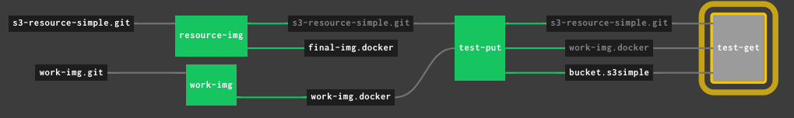

# Simple S3 Resource for Concourse

This is a fork of the Concourse resource s3-resource-simple.

## Consuming this resource

```YAML
resource_types:
- name: s3-resource-simple
  type: registry-image
  source:
    # No `tag:` specified: will pick up `latest`.
    repository: MYREGISTRY/s3-resource-simple
```

## Pipelines to build and test this resource



The pipeline file at [ci/s3-resource-simple-pipeline.yml](ci/s3-resource-simple-pipeline.yml) enables a workflow where you can have per-feature branch pipelines plus a master pipeline.

### Master branch pipeline

The master branch pipeline, `s3-resource-simple-master`, will push the Docker image for the Concourse resource to repository `s3-resource-simple` with tag `latest`, so that any client pipeline will pick it up immediately.

Each time a feat branch is merged into the master branch, this pipeline will run and publish a new Docker image.

### Feature branch pipelines

Given feature branch `feat-x`, the associated feature branch pipeline `s3-resource-simple-feat-x` will push the Docker image for the Concourse resource to repository `s3-resource-simple` with tag `feat-x`, so that additional integrations tests can be done by referring to the scratch repository with the tag `feat-x` without impacting users of the published resource.

### Configuration

* Add to your Concourse credentials manager the needed secrets.
* Optionally change files `ci/settings/master-branch.yml` and `ci/settings/feature-branch.yml`.

### Setting the master pipeline

```shell
fly_helper set-pipeline --allow-setting-master-branch
```

### Setting the feature branch pipeline

```shell
fly_helper set-pipeline
```

### Understanding the different Docker images at play

With reference to the pipeline, there are two jobs, `work-img` and `resource-img`.

* Job `work-img` is used to build images for the workings of the pipeline itself, that is, to run the test tasks.
* Job `resource-img` builds the final product of this pipeline: the Concourse resource `s3-resource-simple`.

## WARNING: Everything below is outdated

Resource to upload files to S3. Unlike the [the official S3 Resource](https://github.com/concourse/s3-resource), this Resource can upload or download multiple files.

## Usage

Include the following in your Pipeline YAML file, replacing the values in the angle brackets (`< >`):

```yaml
resource_types:
  - name: <resource type name>
    type: registry-image
    source:
      repository: 18fgsa/s3-resource-simple
resources:
  - name: <resource name>
    type: <resource type name>
    source:
      access_key_id: { { aws-access-key } }
      secret_access_key: { { aws-secret-key } }
      bucket: { { aws-bucket } }
      path: <optional, use to sync to a specific path of the bucket instead of root of bucket>
      options: [<optional, see note below>]
      region: <optional, see below>
      sync: <optional, see below>
jobs:
  - name: <job name>
    plan:
      - <some Resource or Task that outputs files>
      - put: <resource name>
        params:
          dir: assets
```

## AWS Credentials

The `access_key_id` and `secret_access_key` are optional and if not provided the EC2 Metadata service will be queried for role based credentials.

## Options

The `options` parameter is synonymous with the options that `aws cli` accepts for `sync`. Please see [S3 Sync Options](http://docs.aws.amazon.com/cli/latest/reference/s3/sync.html#options) and pay special attention to the [Use of Exclude and Include Filters](http://docs.aws.amazon.com/cli/latest/reference/s3/index.html#use-of-exclude-and-include-filters).

Given the following directory `test`:

```
test
├── results
│   ├── 1.json
│   └── 2.json
└── scripts
    └── bad.sh
```

we can upload _only_ the `results` subdirectory by using the following `options` in our task configuration:

```yaml
options:
  - "--exclude '*'"
  - "--include 'results/*'"
```

### Region

Interacting with some AWS regions (like London) requires AWS Signature Version

4. This options allows you to explicitly specify region where your bucket is
   located (if this is set, AWS_DEFAULT_REGION env variable will be set accordingly).

```yaml
region: eu-west-2
```

### Sync

By default files will _not_ be synced from s3. Disabling this will download all files.

```yaml
sync: true
```

### Dir

Will change the working directory to subdirectory before invoking the sync

```yaml
dir: subdirectory
```
